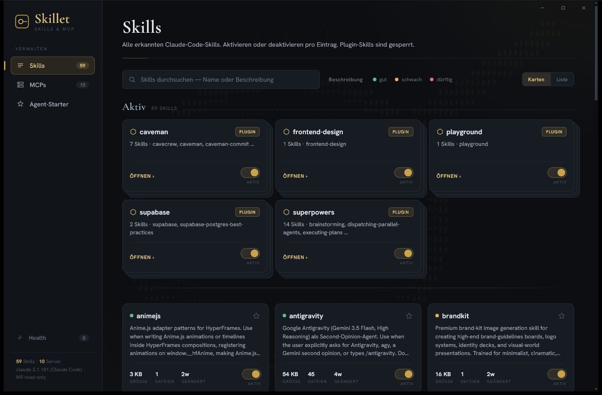

# Skillet

[](https://opensource.org/licenses/MIT)


<p align="center">
  <strong>Your tools say a skill is installed.<br>Skillet shows you what you actually have — and which skills will never fire.</strong>
</p>

Skillet is a local desktop atelier for your **Claude Code** setup. It reads the
skills and MCP servers the CLI already keeps under `~/.claude` and lays them out
in one calm, dark-gold window — personal, project and plugin skills in a single
inventory, each plugin folded into a card stack, with a quick
description-quality check so the skills that will never trigger stand out.

<p align="center">
  
</p>

This is the **M0** milestone: Skillet reads from disk, it does not write. The
enable/disable and favourite toggles are an interactive preview of the upcoming
write mode.

## Features

- One inventory of every skill — **personal**, **project** and **plugin**
- Plugin skills collapse into a **card stack**; click to pop out the sub-skills
- **Description-quality** dots (good / weak / poor) so dead skills stand out
- **Favourites** — star a skill to pin it above the rest
- **MCP servers** view — transport, scope and live connection status
- **Health** view — surfaces conflicts, drift and weak descriptions
- Card and dense **list** density, with per-skill detail pop-outs
- Custom frameless window chrome and a quiet, design-matched scrollbar

## How it works

Skillet never asks you for anything. It reads what the Claude Code CLI already
wrote, all in the Rust backend:

1. **Skills** are scanned across three scopes — personal (`~/.claude/skills/`),
   project (the nearest `.claude/skills/`) and plugin, resolved from
   `~/.claude/plugins/installed_plugins.json` so each plugin is counted once
   (no cache/marketplace duplicates).
2. Every `SKILL.md` is parsed for its frontmatter, and the description is run
   through a small lint that checks whether it signals *when* the skill fires.
3. **MCP servers** are pulled from `claude mcp list` on a timed worker thread,
   so a hanging health check never freezes the window.
4. **Health** cross-checks the scanned skills and servers — name collisions,
   drift on disk, weak descriptions — and lists the findings by severity.

## Requirements

- **Windows 10/11** with WebView2 (pre-installed on modern Windows)
- The [Claude Code](https://claude.com/claude-code) CLI installed, so that
  `~/.claude` and the `claude` command exist

## Build from source

### Prerequisites

- [Rust](https://rustup.rs/) (stable)
- [Node.js](https://nodejs.org/) 20+
- Windows: Microsoft C++ Build Tools

### Steps

```bash
git clone https://github.com/offbyone1/skillet.git
cd skillet
npm install
npx tauri build      # installers land in src-tauri/target/release/bundle/
```

For development with hot reload:

```bash
npm install
npx tauri dev
```

## Privacy

Skillet is local-first. Every read happens in the Rust backend, against files
the Claude Code CLI already wrote to your machine. There is no account, no
Skillet backend, and no telemetry — nothing leaves your computer.

## Status

M0 — read-only. Skillet scans and displays; it does not modify anything on
disk. Planned next: write mode (actually enable/disable skills and servers) and
**Agent-Starter** loadout profiles that bundle a set of skills + MCPs for a
given working mode.

## License

[MIT](LICENSE) (c) [offbyone1](https://github.com/offbyone1)
