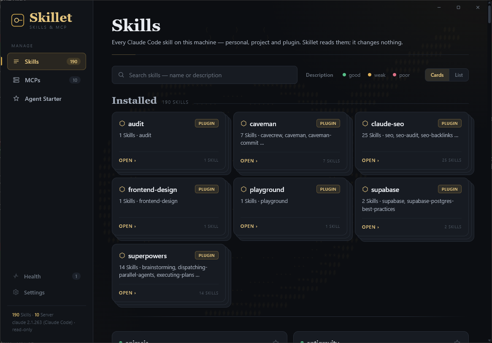
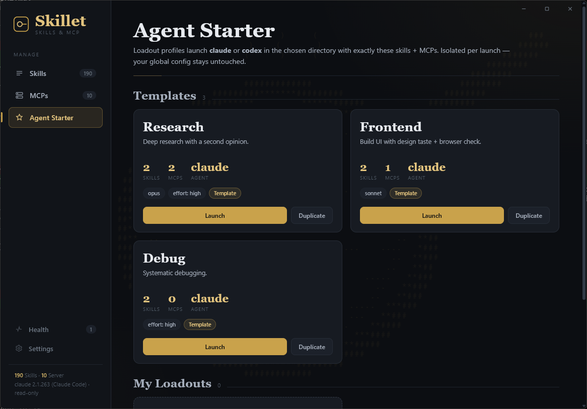

# Skillet

[](LICENSE)
[](#install)
[](https://v2.tauri.app/)
[](https://github.com/offbyone1/skillet/releases/latest)
[](https://github.com/offbyone1/skillet/actions/workflows/ci.yml)

<p align="center">
  <strong>Your tools say a skill is installed.<br>Skillet shows you what you actually have — and which skills will never fire.</strong>
</p>

<p align="center">
  
</p>

Skillet is a local desktop atelier for your **Claude Code** setup. It reads the
skills and MCP servers the CLI already keeps under `~/.claude` and lays them out
in one calm, dark-gold window: personal, project and plugin skills in a single
inventory, each plugin folded into a card stack, a description-quality check so
the skills that will never trigger stand out, and loadout profiles that launch
an agent session with exactly the skills and servers you picked.

Skillet reads `~/.claude`; it never writes there.

## Features

- One inventory of every skill — **personal**, **project** and **plugin**
- Plugin skills collapse into a **card stack**; click to pop out the sub-skills
- **Description-quality** dots (good / weak / poor) so dead skills stand out
- **Favorites** — star a skill to pin it above the rest
- **MCP servers** view — transport, scope and live connection status
- **Health** view — name collisions, weak descriptions and oversized skills, by severity
- **Agent Starter** — loadout profiles that launch `claude` or `codex` with a chosen working directory, skill set, MCP set, model, effort and flags; three templates to start from
- Card and dense **list** density, per-skill detail pop-outs, dark and light theme
- **Signed in-app updates** from this repository's releases, checked once a day if you let it

<p align="center">
  
</p>

## How it works

Skillet never asks you for anything. It reads what the Claude Code CLI already
wrote, all in the Rust backend:

1. **Skills** are scanned across three scopes — personal (`~/.claude/skills/`),
   project (the nearest `.claude/skills/`) and plugin, resolved from
   `~/.claude/plugins/installed_plugins.json` so each plugin is counted once.
2. Every `SKILL.md` is parsed for its frontmatter, and the description is run
   through a small lint that checks whether it signals *when* the skill fires.
3. **MCP servers** come from `claude mcp list`, run on a worker thread so a
   hanging health check never freezes the window.
4. **Health** cross-checks the scanned skills — name collisions across scopes,
   weak descriptions, skill folders above 1 MB — and lists the findings by severity.

### Agent Starter

A loadout is a saved profile: working directory, agent (`claude` or `codex`),
skills, MCP servers, model, effort, an optional headless prompt and the
skip-permissions flag. "Launch" opens a new terminal with that session.

For Claude, every launch is an isolated projection. Skillet copies the selected
skills into a throw-away folder under `~/.skillet/launch/` and starts the CLI
with `--add-dir`, `--mcp-config --strict-mcp-config` and
`--setting-sources project`, so your global skills, plugins and MCP servers stay
out of the session and parallel sessions do not interfere. The project's own
`.claude/` configuration in the working directory still applies, on purpose.

Headless prompts and `--dangerously-skip-permissions` are risky. When either is
set and the working directory carries project configuration (`CLAUDE.md`,
settings, hooks, `.mcp.json`, project skills), Skillet shows what it found and
refuses to launch until you confirm you trust the directory. That gate lives in
the backend, not only in the UI. Details in [SECURITY.md](SECURITY.md).

Codex launches are plain: working directory, model, prompt and skip-permissions.
Skill and MCP isolation are Claude-only.

## Requirements

- **Windows 10/11** with WebView2 (pre-installed on modern Windows)
- The [Claude Code](https://claude.com/claude-code) CLI installed, so that
  `~/.claude` and the `claude` command exist
- Optional: the Codex CLI, for Codex loadouts

## Install

Download `Skillet_x.y.z_x64-setup.exe` (or the `.msi`) from the
[latest release](https://github.com/offbyone1/skillet/releases/latest) and run
it. It installs for the current user; no administrator rights needed. Skillet
checks for signed updates once a day and installs them when you say so
(Settings → Updates).

Releases are not code-signed with a Windows certificate. SmartScreen may show
"Windows protected your PC" on first start; choose "More info → Run anyway", or
build from source.

## Build from source

### Prerequisites

- [Rust](https://rustup.rs/) (stable)
- [Node.js](https://nodejs.org/) 20+
- Windows: Microsoft C++ Build Tools

### Steps

```bash
git clone https://github.com/offbyone1/skillet.git
cd skillet
npm install
npx tauri build      # installers land in src-tauri/target/release/bundle/
```

For development with hot reload:

```bash
npm install
npx tauri dev
```

## Releases & auto-update

Releases are produced by the GitHub Actions workflow in
[`.github/workflows/release.yml`](.github/workflows/release.yml). Pushing a
version tag (e.g. `v0.1.0`) that matches the version in
`src-tauri/tauri.conf.json` builds the signed installers and the `latest.json`
manifest, then attaches them to a draft GitHub release. The app's updater
endpoint points at this repo's `releases/latest`, so shipped builds upgrade
themselves once a newer release is published.

The workflow needs two repository secrets:

| Secret | What it is |
| --- | --- |
| `TAURI_SIGNING_PRIVATE_KEY` | The minisign private key matching the `pubkey` in `tauri.conf.json` |
| `TAURI_SIGNING_PRIVATE_KEY_PASSWORD` | The password for that key |

Generate a key pair once with `npx tauri signer generate` and keep the private
key out of the repo. Set the secrets from a shell that writes plain UTF-8, for
example `gh secret set TAURI_SIGNING_PRIVATE_KEY < key` in bash; Windows
PowerShell 5.1 adds a byte-order mark and the signer then fails with
"Invalid symbol 239".

## Tests

```bash
npm run check                                   # svelte-check
cargo test --manifest-path src-tauri/Cargo.toml # parsers, launcher argv, profiles
```

The Rust tests cover the `claude mcp list` parser and the `SKILL.md` scanner
with real, sanitized CLI output as fixtures, the health analysis, the launch
argument builder and the profile store.

## Privacy

Skillet is local-first. Every read happens in the Rust backend, against files
the Claude Code CLI already wrote to your machine. There is no account, no
Skillet backend and no telemetry. The only network request Skillet makes on its
own is the update check against GitHub, and you can turn that off. Fonts ship
with the app. `claude mcp list` runs the CLI's own health checks against the
MCP servers you configured.

## Status

0.1: read-only inventory, health and the Agent Starter. Skillet does not
enable, disable or edit skills and servers; a write mode may come later. See
[CHANGELOG.md](CHANGELOG.md).

## Contributing

See [CONTRIBUTING.md](CONTRIBUTING.md) for setup, structure and ground rules.

## Support

Buy me a Token:

[](https://ko-fi.com/M4M11VBHXH)

## License

[MIT](LICENSE) (c) [offbyone1](https://github.com/offbyone1)
